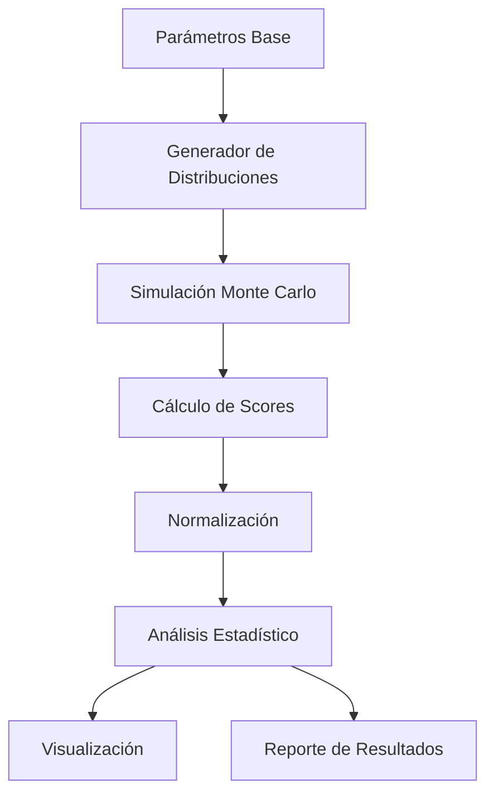

# Documentación Técnica: Simulación Monte Carlo para Ponderaciones de Data Governance

## Tabla de Contenidos
1. [Arquitectura del Modelo](#arquitectura-del-modelo)
2. [Especificaciones Técnicas](#especificaciones-técnicas)
3. [Distribuciones Probabilísticas](#distribuciones-probabilísticas)
4. [Algoritmo de Simulación](#algoritmo-de-simulación)
5. [Métricas y Validación](#métricas-y-validación)
6. [Guía de Implementación](#guía-de-implementación)
7. [Troubleshooting](#troubleshooting)

## Arquitectura del Modelo

### Componentes Principales

```
├── Factor Distributions Generator
│   ├── Regulatory Impact (Beta distributions)
│   ├── Operational Impact (Normal truncated)
│   ├── Financial Risk (Log-normal)
│   └── Competitive Advantage (Triangular)
├── Weight Generator (Dirichlet distribution)
├── Maturity Factors (Gamma distributions)
├── Monte Carlo Engine
├── Statistical Analyzer
└── Visualization Engine
```

### Flujo de Datos



## Especificaciones Técnicas

### Dependencias

```python
numpy >= 1.21.0
matplotlib >= 3.5.0
pandas >= 1.3.0
scipy >= 1.7.0
seaborn >= 0.11.0
```

### Configuración Global

| Parámetro | Valor | Descripción |
|-----------|-------|-------------|
| `n_simulations` | 1000 | Número de iteraciones Monte Carlo |
| `random_seed` | 42 | Semilla para reproducibilidad |
| `confidence_level` | 0.95 | Nivel de confianza para intervalos |

## Distribuciones Probabilísticas

### 1. Impacto Regulatorio

**Justificación**: El sector farmacéutico requiere modelización asimétrica del impacto regulatorio.

| Componente | Distribución | Parámetros | Media Teórica | Interpretación |
|------------|-------------|------------|---------------|----------------|
| DataMAT | Beta(9,1) | α=9, β=1 | 0.90 | Alto impacto regulatorio |
| DataIA | Beta(3,7) | α=3, β=7 | 0.30 | Impacto emergente |
| DataEthics | Beta(6,4) | α=6, β=4 | 0.60 | Importancia creciente |

```python
# Implementación de ejemplo
reg_datamat = np.random.beta(9, 1, n_simulations)
```

### 2. Impacto Operacional

**Justificación**: Variabilidad operacional con límites naturales [0,1].

| Componente | Distribución | Media | Desv. Std | Interpretación |
|------------|-------------|-------|-----------|----------------|
| DataMAT | N(0.8, 0.12) | 0.8 | 0.12 | Alto impacto operacional |
| DataIA | N(0.4, 0.15) | 0.4 | 0.15 | Impacto medio con variabilidad |
| DataEthics | N(0.3, 0.09) | 0.3 | 0.09 | Impacto bajo pero estable |

### 3. Riesgo Financiero

**Justificación**: Distribuciones log-normales capturan eventos de cola pesada típicos en riesgos financieros.

| Componente | Distribución | μ | σ | Interpretación |
|------------|-------------|---|---|----------------|
| DataMAT | LogN(ln(0.85), 0.2) | ~0.85 | Variable | Alto riesgo si deficiente |
| DataIA | LogN(ln(0.15), 0.3) | ~0.15 | Alta varianza | Riesgo emergente |
| DataEthics | LogN(ln(0.65), 0.25) | ~0.65 | Media varianza | Riesgo reputacional |

### 4. Ventaja Competitiva

**Justificación**: Distribuciones triangulares reflejan estimaciones con límites conocidos y moda específica.

| Componente | Distribución | Min | Moda | Max | Interpretación |
|------------|-------------|-----|------|-----|----------------|
| DataMAT | Tri(0.3, 0.5, 0.7) | 0.3 | 0.5 | 0.7 | Ventaja moderada |
| DataIA | Tri(0.6, 0.8, 1.0) | 0.6 | 0.8 | 1.0 | Alto potencial |
| DataEthics | Tri(0.4, 0.6, 0.8) | 0.4 | 0.6 | 0.8 | Ventaja estable |

## Algoritmo de Simulación

### Pseudocódigo Principal

```
FOR i = 1 to n_simulations:
    1. Generar impactos ~ Distribuciones específicas
    2. Generar pesos ~ Dirichlet(α)
    3. Generar factores_madurez ~ Gamma(shape, scale)
    
    4. Calcular score_j = Σ(impacto_j,k × peso_k) × madurez_j
       donde j ∈ {DataMAT, DataIA, DataEthics}
             k ∈ {regulatorio, operacional, riesgo, competitivo}
    
    5. Normalizar: peso_j = score_j / Σ(score_j)
    
    6. Almacenar pesos normalizados
END FOR
```

### Función de Score Compuesto

La función de utilidad para cada componente se define como:

```
U_j = [Σ_{k=1}^4 (I_{j,k} × W_k)] × M_j
```

Donde:
- `U_j`: Utilidad del componente j
- `I_{j,k}`: Impacto del componente j en la dimensión k
- `W_k`: Peso de la dimensión k
- `M_j`: Factor de madurez del componente j

## Métricas y Validación

### Métricas Estadísticas Calculadas

| Métrica | Fórmula | Interpretación |
|---------|---------|----------------|
| Media | μ = (1/n)Σx_i | Valor esperado |
| Mediana | Q50 | Valor central robusto |
| Desviación Estándar | σ = √[(1/n)Σ(x_i-μ)²] | Dispersión |
| Intervalo de Confianza 95% | [P2.5, P97.5] | Rango de incertidumbre |
| Coeficiente de Variación | CV = σ/μ | Variabilidad relativa |

### Validaciones Implementadas

1. **Validación de Suma**: Σ(pesos) = 1 ± ε
2. **Validación de Rango**: pesos ∈ [0,1]
3. **Validación de Convergencia**: Estabilidad de momentos
4. **Validación de Coherencia**: Correlaciones esperadas

### Error Cuadrático Medio (MSE)

```python
MSE = (1/3) × Σ[(peso_propuesto_i - peso_MC_i)²]
RMSE = √MSE
```

## Guía de Implementación

### Instalación y Configuración

```bash
# Crear entorno virtual
python -m venv monte_carlo_env
source monte_carlo_env/bin/activate  # Linux/Mac
# o
monte_carlo_env\Scripts\activate     # Windows

# Instalar dependencias
pip install numpy matplotlib pandas scipy seaborn
```

### Ejecución Básica

```python
# Importar módulo principal
from monte_carlo_weights import main

# Ejecutar análisis completo
results, weights_datamat, weights_dataia, weights_ethics = main()

# Acceder a resultados específicos
print(f"DataMAT medio: {results['DataMAT']['mean']:.3f}")
print(f"Intervalo de confianza DataIA: {results['DataIA']['ci_95']}")
```

### Personalización de Parámetros

```python
# Modificar número de simulaciones
n_simulations = 5000

# Ajustar distribuciones
def custom_regulatory_impact():
    # DataMAT más conservador
    reg_datamat = np.random.beta(8, 2, n_simulations)
    return reg_datamat

# Cambiar pesos base para Dirichlet
base_weights = [0.40, 0.30, 0.20, 0.10]  # Menos peso regulatorio
```

### Interpretación de Outputs

#### Archivo de Resultados
```
RESULTADOS MONTE CARLO:
DataMAT:
  Media: 0.XXX (XX.X%)
  Mediana: 0.XXX (XX.X%)
  Desv. Estándar: 0.XXX
  IC 95%: [0.XXX, 0.XXX]
  Rango: [0.XXX, 0.XXX]
```

#### Visualizaciones Generadas
1. **Histograma**: Distribuciones de ponderaciones
2. **Box Plot**: Comparación de dispersiones
3. **Scatter Plot**: Correlaciones entre componentes
4. **Series Temporales**: Evolución por simulación

## Troubleshooting

### Problemas Comunes

#### Error: "Suma de pesos ≠ 1"
**Causa**: Problema numérico en normalización
```python
# Solución: Forzar normalización
total = scores_datamat[i] + scores_dataia[i] + scores_ethics[i]
if total > 0:
    weights_datamat[i] = scores_datamat[i] / total
else:
    weights_datamat[i] = 1/3  # Distribución uniforme como fallback
```

#### Warning: "Distribución truncada genera valores fuera de rango"
**Causa**: Parámetros de distribución normal permiten valores negativos
```python
# Solución: Aplicar clipping
op_datamat = np.clip(np.random.normal(0.8, 0.12, n_simulations), 0, 1)
```

#### Performance: "Simulación lenta con n_simulations alto"
**Solución**: Optimización vectorizada
```python
# En lugar de loops, usar operaciones vectorizadas
scores_all = impacts_matrix @ weights_matrix * maturity_factors
```

### Logs de Debug

```python
import logging

logging.basicConfig(level=logging.DEBUG)
logger = logging.getLogger(__name__)

def debug_simulation(i, scores):
    if i % 100 == 0:
        logger.debug(f"Simulación {i}: scores = {scores}")
```

### Verificación de Resultados

```python
def validate_results(weights_datamat, weights_dataia, weights_ethics):
    """Función de validación completa"""
    
    # Test 1: Suma = 1
    sums = weights_datamat + weights_dataia + weights_ethics
    assert np.allclose(sums, 1.0, atol=1e-10), "Suma de pesos incorrecta"
    
    # Test 2: Rango [0,1]
    assert np.all(weights_datamat >= 0) and np.all(weights_datamat <= 1)
    assert np.all(weights_dataia >= 0) and np.all(weights_dataia <= 1)
    assert np.all(weights_ethics >= 0) and np.all(weights_ethics <= 1)
    
    # Test 3: No NaN
    assert not np.any(np.isnan(weights_datamat))
    
    print("✓ Todas las validaciones pasaron")
```

## Extensiones Recomendadas

### 1. Análisis de Sensibilidad
```python
def sensitivity_analysis():
    """Analiza sensibilidad a cambios en parámetros"""
    param_ranges = {
        'beta_alpha': np.arange(7, 12, 0.5),
        'normal_std': np.arange(0.08, 0.18, 0.02)
    }
    # Implementar grid search sobre parámetros
```

### 2. Validación Cruzada Temporal
```python
def temporal_validation():
    """Valida estabilidad temporal del modelo"""
    # Dividir simulaciones en períodos
    # Comparar distribuciones entre períodos
```

### 3. Incorporación de Correlaciones
```python
def correlated_impacts():
    """Genera impactos correlacionados usando matriz de covarianza"""
    cov_matrix = np.array([
        [1.0, 0.3, 0.2, 0.1],
        [0.3, 1.0, 0.4, 0.2],
        [0.2, 0.4, 1.0, 0.3],
        [0.1, 0.2, 0.3, 1.0]
    ])
    return np.random.multivariate_normal(means, cov_matrix, n_simulations)
```

---

*Documentación generada para análisis Monte Carlo v1.0*
*Última actualización: [Fecha actual]*
*Contacto técnico: [Equipo de Data Governance]*
